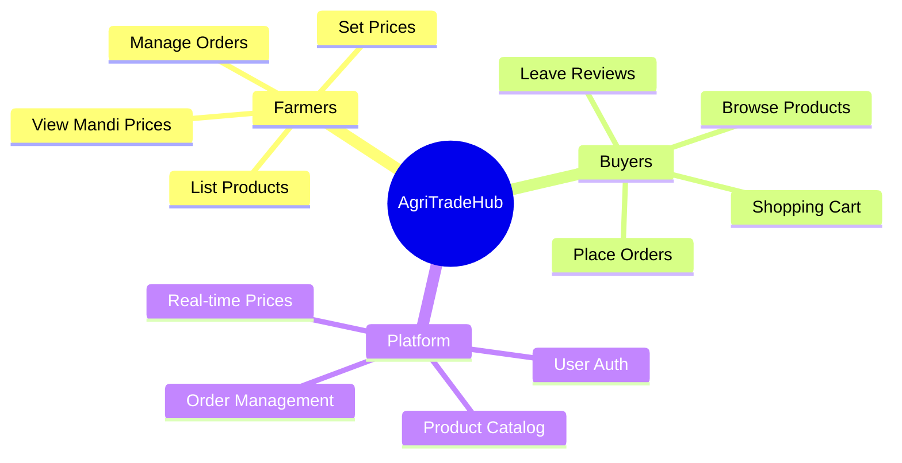
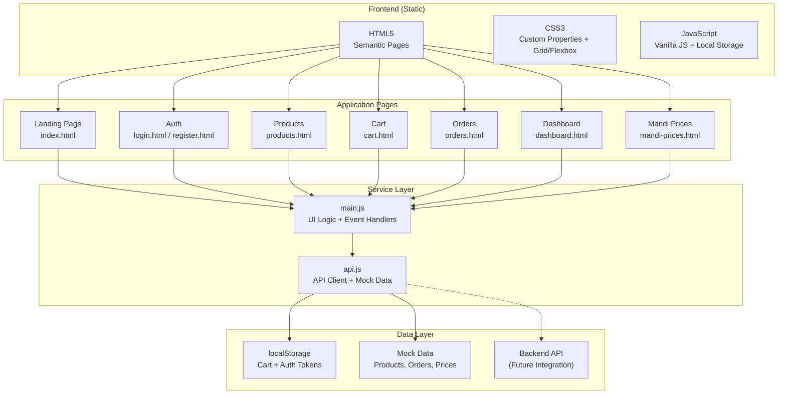
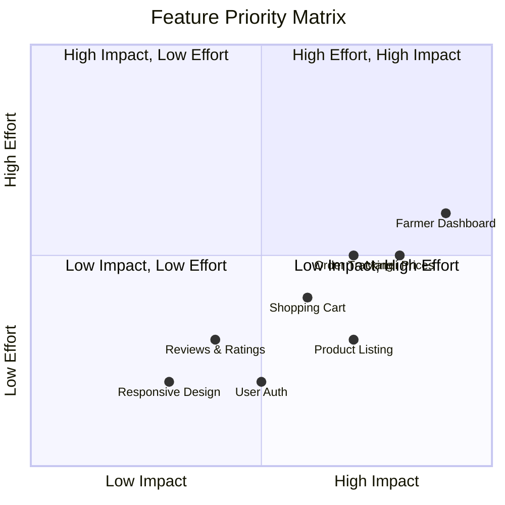
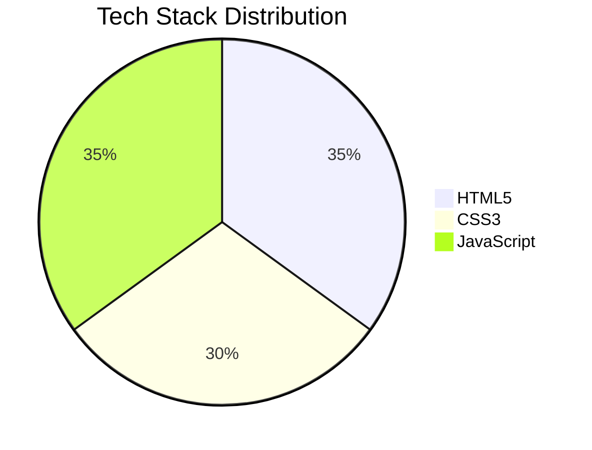
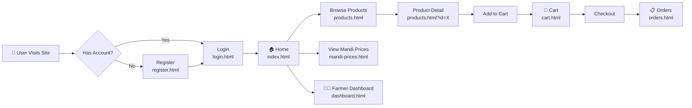
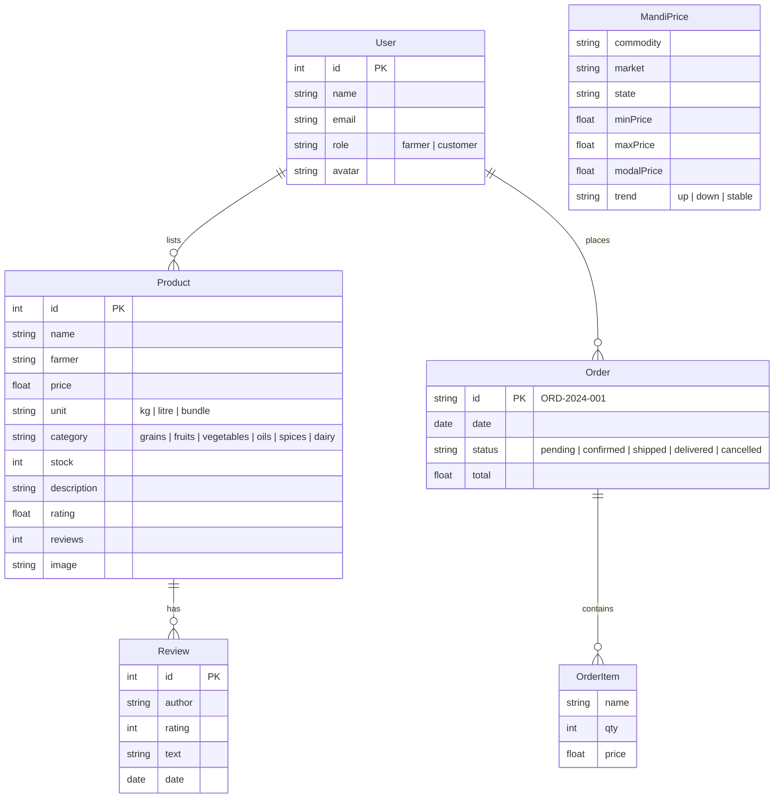
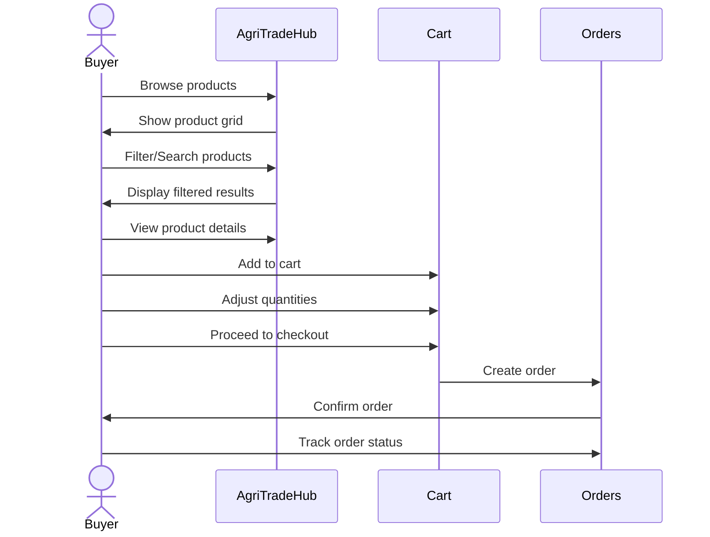
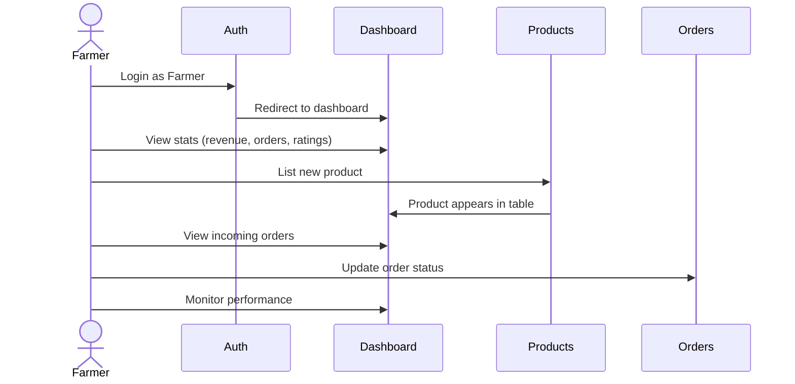
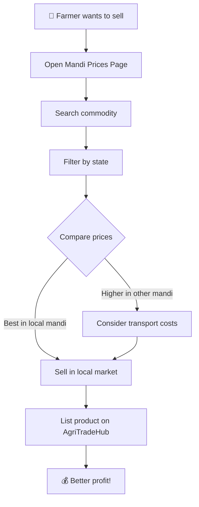
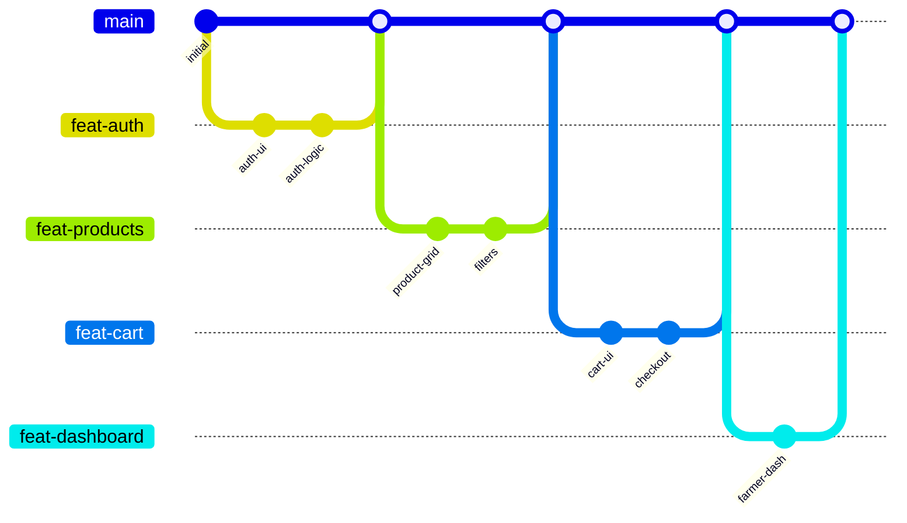

# 🌾 AgriTradeHub

> **Farm-to-Market Digital Marketplace** — Connecting farmers directly with buyers for fair pricing, transparency, and quality produce.

[](https://ayushdixit1-av.github.io/AgriTradeHub/)
[](https://developer.mozilla.org/en-US/docs/Web/HTML)
[](https://developer.mozilla.org/en-US/docs/Web/CSS)
[](https://developer.mozilla.org/en-US/docs/Web/JavaScript)

---

## 📋 Table of Contents

- [Overview](#-overview)
- [Architecture](#-architecture)
- [Features](#-features)
- [Tech Stack](#-tech-stack)
- [Pages & Screens](#-pages--screens)
- [Data Model](#-data-model)
- [User Flows](#-user-flows)
- [Getting Started](#-getting-started)
- [Deployment](#-deployment)
- [Contributing](#-contributing)

---

## 📌 Overview

AgriTradeHub is a full-stack digital marketplace designed to eliminate intermediaries in agricultural trade. It empowers farmers with:

- **Direct access** to consumers for fair pricing
- **Real-time mandi prices** for informed selling decisions
- **Role-based access** for farmers and buyers
- **Secure transactions** with order tracking



---

## 🏗 Architecture



---

## ✨ Features



| Feature | Description |
|---------|-------------|
| 🔐 **User Authentication** | Login/Register with role selection (Farmer/Buyer) |
| 📦 **Product Management** | List, search, filter, and sort farm products |
| 🛒 **Shopping Cart** | Add/remove items, quantity control, order summary |
| 📋 **Order Management** | Track order status (pending → shipped → delivered) |
| 📊 **Farmer Dashboard** | Stats, product table, recent orders overview |
| 📈 **Mandi Prices** | Real-time market price data with trends (▲▼◆) |
| ⭐ **Reviews & Ratings** | Customer feedback on products |
| 📱 **Responsive Design** | Works on desktop, tablet, and mobile |

---

## 🛠 Tech Stack



| Layer | Technology | Purpose |
|-------|-----------|---------|
| **Markup** | HTML5 | Semantic structure, SEO-friendly |
| **Styling** | CSS3 | Custom properties, Grid, Flexbox, responsive |
| **Logic** | Vanilla JavaScript | DOM manipulation, state management |
| **Storage** | localStorage | Cart persistence, auth tokens |
| **Hosting** | GitHub Pages | Static site deployment |

---

## 📄 Pages & Screens



| Page | Route | Purpose |
|------|-------|---------|
| 🏠 **Home** | `index.html` | Hero, featured products, mandi preview, testimonials |
| 🔑 **Login** | `login.html` | Email/password auth with demo credentials |
| 📝 **Register** | `register.html` | Buyer/Farmer role selection |
| 📦 **Products** | `products.html` | Product grid + detail view with reviews |
| 🛒 **Cart** | `cart.html` | Cart items, quantity, order summary |
| 📋 **Orders** | `orders.html` | Order history with status badges |
| 📊 **Dashboard** | `dashboard.html` | Farmer stats, products table, orders |
| 📈 **Mandi Prices** | `mandi-prices.html` | Live market prices with filters |

---

## 💾 Data Model



---

## 🔄 User Flows

### Buyer Flow



### Farmer Flow



### Mandi Price Check Flow



---

## 🚀 Getting Started

```bash
# Clone the repository
git clone https://github.com/ayushdixit1-av/AgriTradeHub.git

# Navigate to project directory
cd AgriTradeHub

# Open with live server (VS Code extension recommended)
# Right-click index.html → Open with Live Server

# Or simply open in browser
start index.html     # Windows
open index.html      # macOS
xdg-open index.html  # Linux
```

### Demo Credentials

| Role | Email | Password |
|------|-------|----------|
| 👨‍🌾 Farmer | `rajesh@farm.com` | any password |
| 👤 Customer | `priya@buyer.com` | any password |

---

## 🌐 Deployment

The site is deployed on **GitHub Pages**:

👉 **[https://ayushdixit1-av.github.io/AgriTradeHub/](https://ayushdixit1-av.github.io/AgriTradeHub/)**

To deploy your own fork:
1. Go to repo **Settings → Pages**
2. Set source to **main branch** (root folder)
3. Wait 1-2 minutes for build
4. Access `https://<username>.github.io/AgriTradeHub/`

---

## 🤝 Contributing



1. Fork the repository
2. Create your feature branch (`git checkout -b feature/amazing-feature`)
3. Commit your changes (`git commit -m 'Add amazing feature'`)
4. Push to the branch (`git push origin feature/amazing-feature`)
5. Open a Pull Request

---

## 📬 Contact

- **Email:** support@agritradehub.in
- **Phone:** +91-1800-123-AGRI
- **Location:** New Delhi, India

---

<p align="center">
  Made with ❤️ for Indian Farmers<br/>
  <strong>Empowering Farmers, Enriching Lives</strong>
</p>
